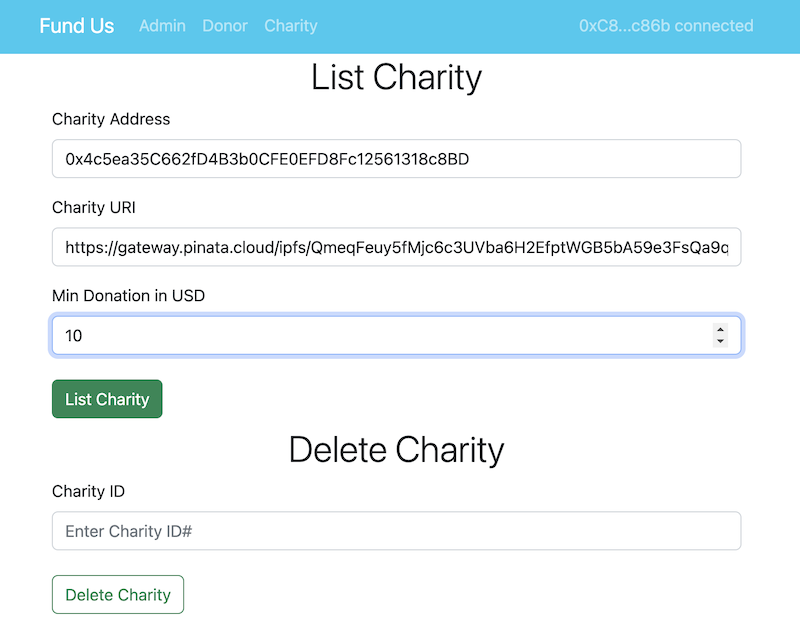
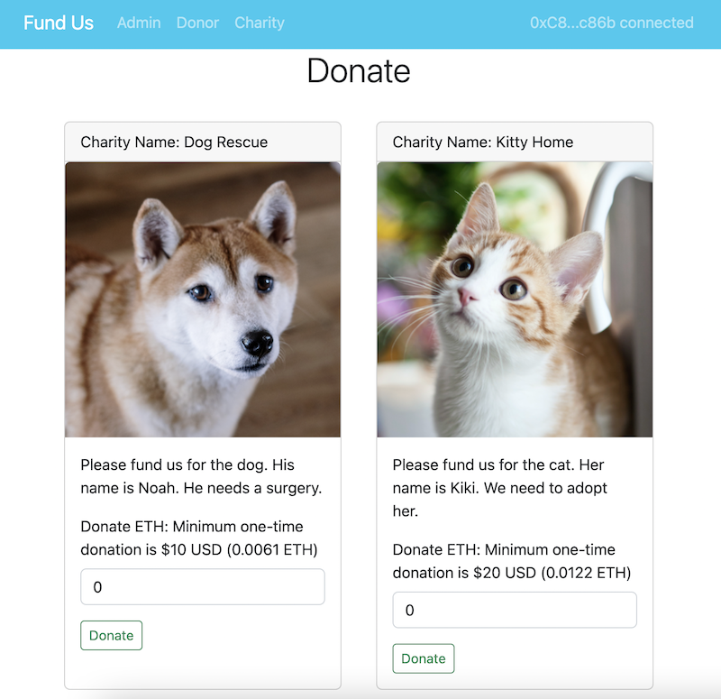
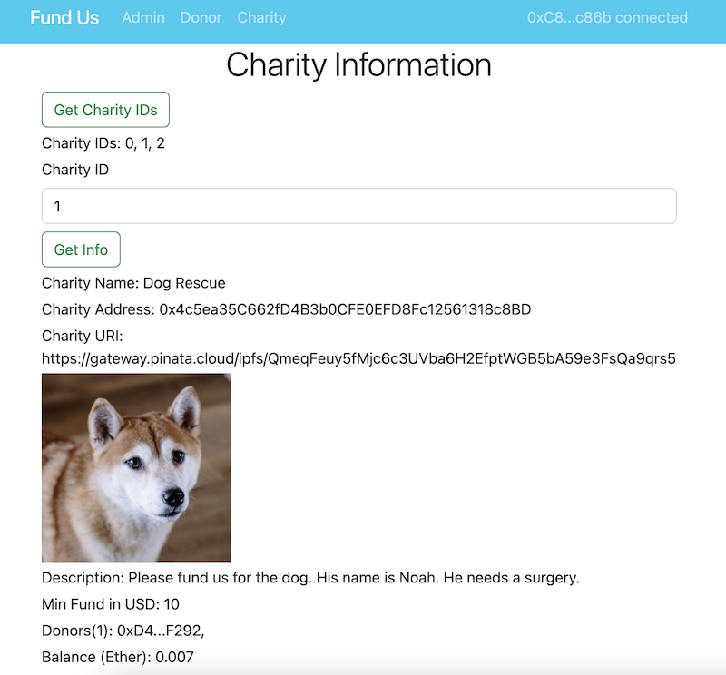
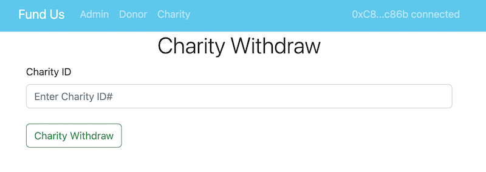

# Hardhat FundUs

The contract owner/admin can create a donation event for a charity. Each donation has a minimum dollar amount (USD). The contract uses [Chainlink Price Feeds](https://docs.chain.link/data-feeds/price-feeds/) to calculate the minimum ETH donors have to donate.

The owner/admin uses Pinata to store the charity's metadata (name, description, and image URL) on IPFS.

The owner/admin can create multiple donation events.

The charity can withdraw funds donated to them.

## Getting Started

```
git clone https://github.com/robertpengcode/FundUs.git
cd FundUs
cd backend
npm init
```

## Usage

Deploy:

```
npx hardhat deploy
```

## Testing

```
npx hardhat test
```

## Test Coverage

```
npx hardhat coverage
```

## Deployment to a testnet or mainnet

1. Setup environment variables

You'll want to set your `GOERLI_RPC_URL` and `PRIVATE_KEY` as environment variables. You can add them to a `.env` file.

2. Get testnet ETH

https://goerlifaucet.com/

3. Deploy

```
npx hardhat deploy --network goerli
```

## Tooling used

Backend:

- Hardhat
- JavaScript/ NodeJs
- Metamask Browser Wallet
- Ethereum Goerli Testnet
- Chainlink Price Feeds
- IPFS - PINATA

React Frontend:

- React-Bootstrap
- Ethers
- React Hooks

## React Frontend

Admin's menu:



Donor's menu:



Home (Info):



Charity's menu:


